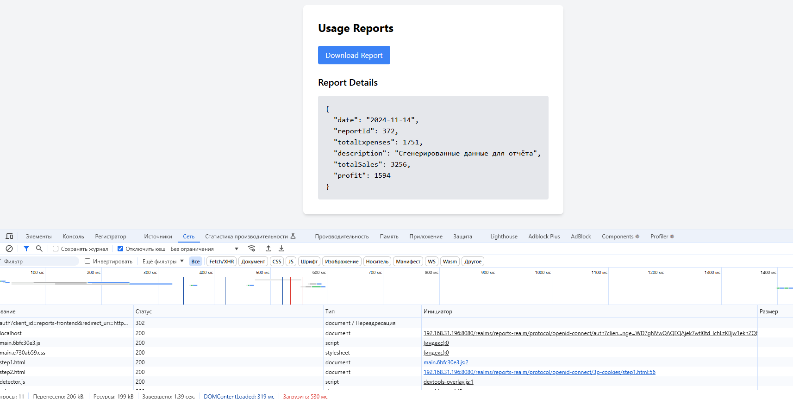
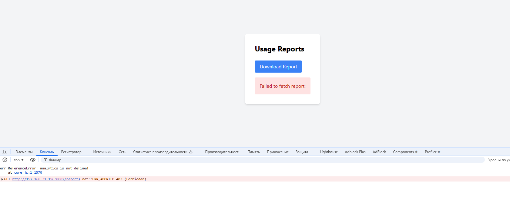

# Внимание для работы на локальной машине необходимо использовать свой ip адресс
## Настройка PKCE в Keycloak

### Включите параметр Proof Key for Code Exchange (PKCE) в realm-export.json

~~~
"directAccessGrantsEnabled": true,
      "attributes": {
        "pkce.code.challenge.method": "S256"
      }
~~~

## Настройка фронтенда для PKCE

### Добавьте параметр initOptions в ReactKeycloakProvider и укажите параметр pkceMethod: 'S256'

~~~
<ReactKeycloakProvider authClient={keycloak}
                           initOptions={{ pkceMethod: process.env.REACT_APP_PKCE_METHOD || "S256" }}
    >
~~~

### Добавьте этот параметр в .env

~~~
REACT_APP_API_URL=http://192.168.31.196:8082
REACT_APP_KEYCLOAK_URL=http://192.168.31.196:8080
REACT_APP_KEYCLOAK_REALM=reports-realm
REACT_APP_KEYCLOAK_CLIENT_ID=reports-frontend
REACT_APP_PKCE_METHOD=S256
~~~

## Подготовка backend c учетом взаимодействия Keycloak

### Настройте Keycloak в application.properties

~~~
spring.application.name=backend
server.port=8082

# Keycloak
spring.security.oauth2.resourceserver.jwt.issuer-uri=${KEYCLOAK_URL:http://localhost:8080}/realms/reports-realm
spring.security.oauth2.resourceserver.jwt.jwk-set-uri=${KEYCLOAK_URL:http://localhost:8080}/realms/reports-realm/protocol/openid-connect/certs
keycloak.realm=reports-realm
keycloak.auth-server-url=${KEYCLOAK_URL:http://localhost:8080}/auth
keycloak.resource=reports-api
keycloak.public-client=true

logging.level.org.springframework.security=DEBUG
logging.level.org.springframework.security.authentication=DEBUG
logging.level.org.springframework.security.web=DEBUG
logging.level.org.springframework.security.oauth2=DEBUG
~~~

### Настройте SecurityConfig с проверкой роли

~~~
@Bean
    public SecurityFilterChain securityFilterChain(HttpSecurity http) throws Exception {
        http
                .csrf(csrf -> csrf.disable())
                .cors(cors -> cors.configurationSource(corsConfigurationSource()))
                .authorizeHttpRequests(auth -> auth
                        .requestMatchers("/reports").hasRole("prothetic_user") // Используем hasRole
                        .anyRequest().permitAll()
                )
                .sessionManagement(session -> session
                        .sessionCreationPolicy(SessionCreationPolicy.STATELESS)
                )
                .oauth2ResourceServer(oauth2 -> oauth2
                        .jwt(jwt -> jwt
                                .jwtAuthenticationConverter(jwtAuthenticationConverter()) // Устанавливаем кастомный конвертер
                        )
                );

        return http.build();
    }
~~~

## Редактируем docker-compose.yaml

~~~
    environment:
      REACT_APP_API_URL: http://192.168.31.196:8082
      REACT_APP_KEYCLOAK_URL: http://192.168.31.196:8080
      REACT_APP_KEYCLOAK_REALM: reports-realm
      REACT_APP_KEYCLOAK_CLIENT_ID: reports-frontend
      REACT_APP_PKCE_METHOD: S256
~~~

~~~
   backend:
    build:
      context: ./backend
      dockerfile: Dockerfile
    ports:
      - "8082:8082"
    environment:
      SPRING_DATASOURCE_URL: jdbc:postgresql://keycloak_db:5432/keycloak_db
      SPRING_DATASOURCE_USERNAME: keycloak_user
      SPRING_DATASOURCE_PASSWORD: keycloak_password
      KEYCLOAK_URL: http://192.168.31.196:8080  # Обновлено для использования имени контейнера
      KEYCLOAK_REALM: reports-realm
      KEYCLOAK_CLIENT_ID: reports-frontend
    depends_on:
      - keycloak
      - keycloak_db
~~~
## данный вариант будет работать только для роли prothetic_user

## при попытке зайти под другой ролью получаем ошибку 403
