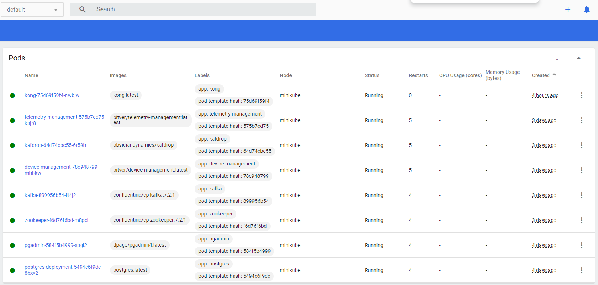
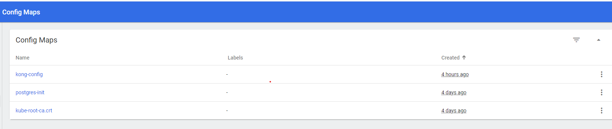

# Развертывание микросервисов в Minikube

В этом руководстве описаны шаги для развертывания микросервисов с использованием Minikube.

## Предварительные требования

1. Установлен Minikube: [Minikube Installation Guide](https://minikube.sigs.k8s.io/docs/start/)
2. Установлен kubectl: [kubectl Installation Guide](https://kubernetes.io/docs/tasks/tools/) 
3. Создайте и примените файлы Deployment и Service для каждого сервиса.
4. Создание ConfigMap.
## Шаг 1: Запуск Minikube

Запустите Minikube с командой:

```bash
minikube start --driver=docker
minikube status
minikube dashboard - опционально
kubectl create namespace my-namespace - опционально
```
## Шаг 2: Запуск kafka

### Примените Deployment

```bash
kubectl apply -f zookeeper-deployment.yml --namespace=my-namespace
kubectl apply -f kafka-deployment.yml --namespace=my-namespace
```

## Шаг 3: Запуск postgres

### Примените Deployment

```bash
kubectl create configmap postgres-init --from-file=postgres-configmap.yaml --namespace=my-namespace
kubectl apply -f postgres-deployment.yaml --namespace=my-namespace
```

## Шаг 3: Запуск postgres

### Примените Deployment

```bash
kubectl create configmap postgres-init --from-file=postgres-configmap.yaml --namespace=my-namespace
kubectl apply -f postgres-deployment.yaml --namespace=my-namespace
```

## Шаг 4: Запуск сервисов DeviceManagement и TelemetryManagement

Предварительно необходимо создать Docker-образы для ваших микросервисов и их публикации в Docker Hub
```bash
docker build -t pitver/device-management:latest .
docker build -t pitver/telemetry-management:latest .
```
Альтернатива необходимо создать Docker-образы для ваших микросервисов и их публикации в GitHub Container Registry
```bash
docker tag device-management ghcr.io/pitver/device-management:latest
docker tag telemetry-management ghcr.io/pitver/telemetry-management:latest
docker push ghcr.io/pitver/device-management:latest
docker push ghcr.io/pitver/telemetry-management:latest
```
#### И в Deployment нужно заменить 
#### image: pitver/telemetry-management:latest - > ghcr.io/pitver/telemetry-management:latest 
#### image: image: pitver/device-management:latest - > ghcr.io/pitver/device-management:latest 

### Примените Deployment

```bash
kubectl apply -f device-management-deployment.yml --namespace=my-namespace
kubectl apply -f telemetry-management-deployment.yml --namespace=my-namespace
```

## Шаг 5: Запуск kong gateway

### Примените Deployment

```bash
kubectl create configmap kong-config --from-file=kong.yml --namespace=my-namespace
kubectl apply -f postgres-deployment.yaml --namespace=my-namespace
```
После всех установок вы должны увидеть



## Шаг 6: тестирование
Так как у нас простейший конфиг, прокиньте порты шлюза наружу
```bash
kubectl port-forward svc/kong 8000:8000 8001:8001
```
Выполните шаги аналогичные шагам №5 тестированию в докере
[тестирование](DOCKER.MD)