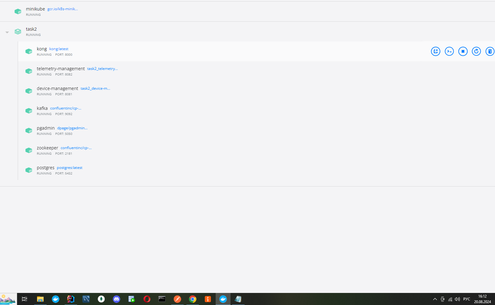

# Task1

## Задание 1.2: Архитектура микросервисов 
### Components Diagram
 - Стрелка, публикующая события в Kafka, теперь исходит из компонента EventPublisher, что логично, поскольку этот компонент отвечает за публикацию событий.
 - Добавлена стрелка от Scheduler к ActionDispatcher, которая указывает, что Scheduler может инициировать действия, отправляя команды в другие сервисы
 - Удалена база данных MonitoringDB в соответствии с предложением, чтобы диаграмма соответствовала логике контейнерной диаграммы, где у MonitoringService базы данных не предусмотрено
### Контейнерная диаграмма
 - Device Registration Service теперь объединён с Device Management Service в один контейнер, так как регистрация устройств — это часть управления ими.
 - Access Control Service объединён с User Management Service для более логичного разделения задач и хранения данных в одной базе
 - Стрелка для подписки на данные датчиков теперь направлена правильно — от Kafka к Automation Service
 - Добавлена стрелка, показывающая публикацию данных из Device Integration Service в Kafka
 - Добавлено взаимодействие между Automation Service и Device Management Service, чтобы показать, как команды от первого направляются для управления устройствами
## Задание 1.3: ER-диаграмма 
- В сущности House поле address было изменено на name, чтобы отразить название типа жилья (например, квартира, дача и т. д.).
- Добавлены указания на первичные ключи (<<PK>>) и внешние ключи (<<FK>>) для всех соответствующих полей в сущностях.
- Новая сущность HouseType
- Добавлено поле type_id, которое является внешним ключом, указывающим на сущность HouseType.
- 
## Задание Задание 1.4: Создание и документирование API 
 - API разделены на 2 отдельных документа

# Task2

## Ошибки при запуске docker compose up -d
- исправлены конфиги для свойства spring.kafka.bootstrap-servers для докера и миникуба отличаются

## Ошибки при запуске в minikube
- исправлены конфиги для свойства spring.datasource.url для докера и миникуба отличаются(по умолчанию выставлен для докера, образы до кубера уже с нужными свойствами)
- исправлены запуски скриптов для создания БД для сервисов(добавлен job). В случае если по каким либо причинам не отработает, необходимо в ручную создать БД DeviceManagement и telemetry

## Задание 2.2 тут наверно не внимательно прочел и сделал обычным способом(это есть только в бизнес задаче, а в разделе, что нужно сделать не указано про кластера)
## Задание 3.1 просто не успеваю физически-довольно серьезные задание в этом спринте